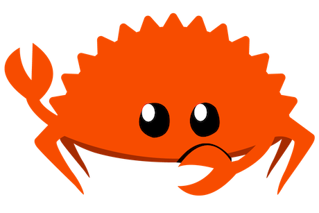

# rusty-automata

## examples

<!-- TODO: add example images -->

### gol

- `cargo run --example neat`

## web

- `cargo install wasm-server-runner`
- `cargo run --example neat --target wasm32-unknown-unknown`
